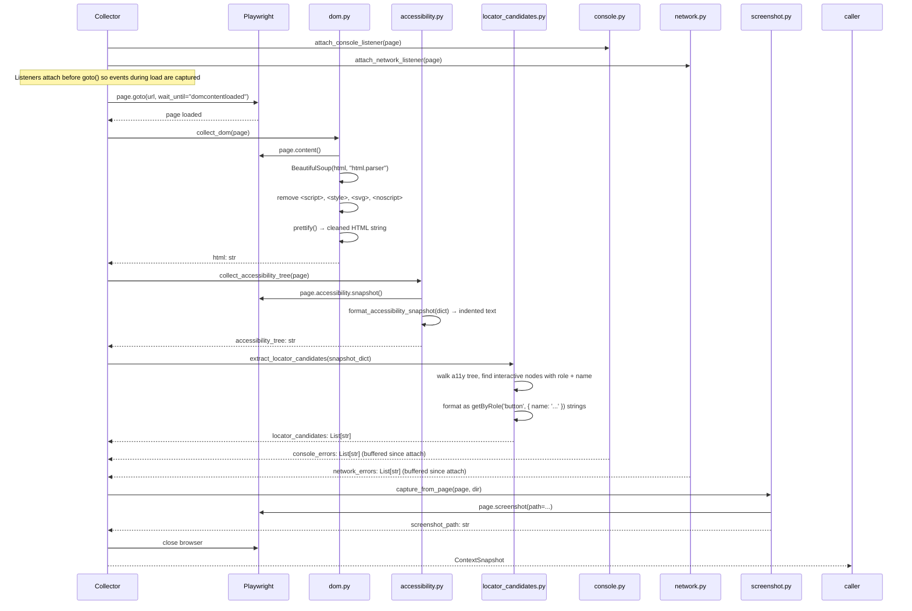

# Context Collection Architecture

> Covers: `src/context/` — `collector.py`, `dom.py`, `accessibility.py`, `locator_candidates.py`, `console.py`, `network.py`, `screenshot.py`

---

## Purpose

Both the generation and healing pipelines need to understand the state of a web page. The context collector opens a single Playwright browser session, navigates to the target URL, and collects five types of context in parallel — returning a `ContextSnapshot` Pydantic model.

**Key constraint:** One browser session per `collect_context()` call. All collectors share the same `page` object. This avoids N cold starts for N context types.

---

## Inputs and Outputs

**Input:** A URL string

**Output:** `ContextSnapshot` (in `schemas/artifacts.py`):

```python
class ContextSnapshot(BaseModel):
    url: str
    html: Optional[str]                  # cleaned HTML (BeautifulSoup)
    accessibility_tree: Optional[str]    # ARIA tree as indented text
    locator_candidates: List[str]        # getByRole() strings
    console_errors: List[str]            # browser console errors
    network_errors: List[str]            # failed requests
    screenshot_path: Optional[str]       # path to screenshot file

    @property
    def is_empty(self) -> bool:
        return not any([self.html, self.accessibility_tree, self.screenshot_path])
```

---

## Collection Sequence



---

## Module Details

### `dom.py` — HTML Collection

Fetches the full rendered HTML via `page.content()` (JavaScript-rendered DOM, not the original source). Cleans it with BeautifulSoup:

- Removes `<script>`, `<style>`, `<svg>`, `<noscript>` tags
- Prettifies the remaining structure

The cleaned HTML gives the LLM structural signals (IDs, `data-test` attributes, class names, form structure) without the noise of inline scripts and styles.

### `accessibility.py` — ARIA Tree

Calls Playwright's `page.accessibility.snapshot()` which returns the browser's computed accessibility tree as a nested dict. This is then formatted as indented text:

```text
document
  landmark (main)
    heading: "Login Page" [level=1]
    text: "This is where you can log in"
    form: "login"
      textbox: "Username" [required]
      textbox: "Password" [required]
      button: "Login"
```

The accessibility tree is the preferred source for locator generation because it contains the ARIA roles and names that `getByRole()` locators use. It is more stable than CSS selectors and more semantically meaningful than raw HTML.

### `locator_candidates.py` — Locator Extraction

Walks the accessibility tree and extracts interactive elements (buttons, links, textboxes, checkboxes, comboboxes, etc.) that have both a role and a name. Formats them as ready-to-use Playwright locator strings:

```python
[
    "getByRole('button', { name: 'Login' })",
    "getByRole('textbox', { name: 'Username' })",
    "getByRole('textbox', { name: 'Password' })",
]
```

These are sent to the healer as "AVAILABLE LOCATORS" — a prioritised list that the LLM is instructed to prefer over manually-constructed selectors.

### `console.py` — Console Error Collection

Attaches a `page.on("console", ...)` listener before `goto()`. Captures messages with level `"error"` or `"warning"`. Stored in a list that is read after the page loads. Used in healing evidence to surface JavaScript errors that may have caused the test failure.

### `network.py` — Network Error Collection

Attaches a `page.on("response", ...)` listener before `goto()`. Captures responses with status >= 400. Formatted as `"STATUS URL"` strings (e.g., `"404 https://example.com/missing-api"`). Used in healing evidence to diagnose CORS errors, missing resources, and broken API endpoints.

### `screenshot.py` — Screenshot Capture

Two entry points:

- `capture_screenshot(url, dir)` — opens its own Playwright session (used by the vision pipeline which needs a fresh session for encoding)
- `capture_from_page(page, dir)` — uses the existing session (used by the context collector)

Screenshots are saved to `tests/screenshots/` by default.

---

## Why a Single Browser Session?

Each browser start in Playwright takes 300–800ms cold. Collecting context in five separate sessions would add 1.5–4 seconds of pure startup overhead per collection. With a single session:

- One cold start
- One `goto()` call
- Collectors read from the already-loaded page
- Total overhead: ~200ms for the collectors

This is especially important for the healing pipeline which may call `gather_evidence()` on every retry attempt.

---

## Fallback Behaviour

`collect_context()` never raises. If any collector fails:

- The `ContextSnapshot` is returned with that field as `None` or `[]`
- The failure is logged at WARNING level
- The pipeline continues with the available context

This ensures that a CORS-blocked accessibility tree or a screenshot permission error does not abort an otherwise-functional healing session.

---

## ContextSnapshot → Evidence

The healing pipeline converts `ContextSnapshot` to `Evidence` via `Evidence.from_context_snapshot()`:

```python
evidence = Evidence.from_context_snapshot(
    error_log=result.output,
    snapshot=snapshot,
    screenshot_path=screenshot_path,
)
```

`Evidence` adds the `error_log` (from the failed test run) to the `ContextSnapshot` fields. The healer receives all context types through this single object.
