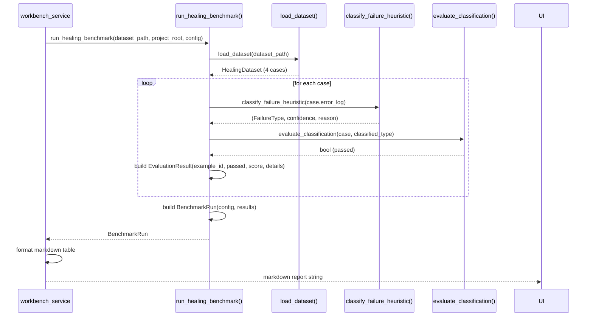

# Evaluation Framework Architecture

> Covers: `benchmarks/` — `healing/runner.py`, `generation/runner.py`, `intent_validation/runner.py`, `mutations/mutator.py`

---

## Purpose

The evaluation framework answers one question: **did this change improve results?** Without it, every model swap, prompt edit, or algorithm change is a guess.

The framework provides:

- Labeled datasets (broken specs + expected repairs, URL scenarios + expected test structures)
- Deterministic runners that measure classification accuracy and repair quality
- Reproducible run records linking model + prompt + temperature + seed + dataset version
- JSON report export for cross-run comparison

---

## Design Principles

**Pure functions, no I/O side effects.** All evaluator functions (`evaluate_classification`, `evaluate_repair`, `evaluate_generated_code`) are pure. They take data in, return a result, and write nothing. File reads happen only in dataset loaders and repair runners.

**Classification-only mode by default.** The healing benchmark's fast path requires no LLM and no browser. It runs the heuristic classifier against synthetic error logs and checks whether the output matches the expected failure type. A full benchmark run completes in under 10ms.

**Injectable healer/generator functions.** Full-repair and generation evaluation accept callable arguments (`healer_fn`, `generator_fn`). This separates the evaluation scaffolding from the AI function under test. A test harness can inject a mock and verify the framework logic; a production benchmark can inject the real pipeline.

**Synthetic mutations produce known failures.** The `mutations/mutator.py` module introduces known failure types into a working spec, producing a `(broken_code, expected_failure_type)` pair that can be evaluated deterministically.

---

## Benchmark Runners

### Healing Benchmark (`benchmarks/healing/runner.py`)

**Dataset:** `benchmarks/healing/fixtures/repair_scenarios.json`

Four cases covering the most common failure types:

| Case ID    | Injected failure  | Error log                                       | Expected classification |
| ---------- | ----------------- | ----------------------------------------------- | ----------------------- |
| `heal-001` | Selector drift    | `locator('#submit-btn') resolved to 0 elements` | `LOCATOR_NOT_FOUND`     |
| `heal-002` | Timeout too short | `TimeoutError: Timeout 5000ms exceeded`         | `TIMEOUT`               |
| `heal-003` | Missing import    | `ReferenceError: expect is not defined`         | `JAVASCRIPT_ERROR`      |
| `heal-004` | Wrong assertion   | `expect(received).toBe(expected)`               | `ASSERTION_FAILED`      |

**Classification-only mode** (default, no LLM):

```python
run = run_healing_benchmark(dataset_path, project_root, config)
# → BenchmarkRun with 4 EvaluationResult objects
```

**Full repair mode** (requires LLM):

```python
def my_healer(broken_code: str, error_log: str) -> str:
    ...  # call analyze_and_plan + apply_fix
    return repaired_code

run = run_healing_benchmark(dataset_path, project_root, config, healer_fn=my_healer)
```

Full repair mode evaluates: classification accuracy + code changed + must-fix patterns removed + must-contain patterns present.

### Generation Benchmark (`benchmarks/generation/runner.py`)

**Dataset:** `benchmarks/generation/fixtures/web_scenarios.json`

Five scenarios covering: login form, checkboxes, dropdown, dynamic elements, static page.

Evaluation is **lexical**: checks that the generated TypeScript contains required imports, uses `expect()`, avoids deprecated selectors, includes the target URL, and prefers accessible locators (`getByRole`, `getByLabel`).

**Generator function injection:**

```python
def my_generator(url: str, feature_description: str) -> str:
    ...  # call the generation pipeline
    return typescript_code

run = run_generation_benchmark(dataset_path, config, generator_fn=my_generator)
```

### Intent Validation (`benchmarks/intent_validation/runner.py`)

Six lexical checks that a generated test encodes the original intent:

1. Imports `@playwright/test`
2. Has at least one `expect()` assertion
3. Does not use deprecated `waitForSelector()`
4. References the target URL
5. Has at least one `getByRole()` or `getByLabel()` locator
6. Has a `test()` block

---

## Mutation Engine (`benchmarks/mutations/mutator.py`)

The mutation engine introduces known failures into a working spec. Four mutation types:

| Mutation            | What it does                                    | Produces            |
| ------------------- | ----------------------------------------------- | ------------------- |
| `selector_drift`    | Replaces a valid locator with a broken one      | `LOCATOR_NOT_FOUND` |
| `timeout_reduction` | Replaces `{ timeout: N }` with `{ timeout: 1 }` | `TIMEOUT`           |
| `import_removal`    | Removes a required import line                  | `JAVASCRIPT_ERROR`  |
| `assertion_swap`    | Replaces `toHaveText()` with `toBe()`           | `ASSERTION_FAILED`  |

```python
broken_code = mutate(original_code, MutationType.SELECTOR_DRIFT, seed=42)
```

The `seed` parameter makes mutations deterministic. The same seed + same input always produces the same broken code. This is essential for reproducible benchmark runs.

---

## BenchmarkRun and Reproducibility

Every run is recorded as a `BenchmarkRun`:

```python
class BenchmarkRunConfig(BaseModel):
    model: str               # e.g. "qwen3.6-35b-a3b"
    model_version: Optional[str]
    provider: str            # "lm_studio" | "ollama"
    prompt_name: str         # e.g. "healer"
    prompt_version: str      # from manifest.json
    prompt_hash: str         # SHA-256 of prompt content
    temperature: float       # 0.0 for reproducibility
    seed: Optional[int]      # model inference seed
    dataset_version: str     # from dataset JSON
    benchmark_type: str      # "healing" | "generation" | "intent_validation"
    timestamp: str
```

A run with the same `config + dataset` at `temperature=0.0` with a fixed `seed` must produce the same results. This is the reproducibility guarantee.

Results are exportable:

```python
run.save_report(Path("benchmarks/reports/"))
# → benchmarks/reports/healing-classification_heuristic-classifier_20260606_142311.json
```

---

## Sequence: Classification Benchmark



---

## Adding a New Benchmark Case

1. Add a new entry to `repair_scenarios.json` (or `web_scenarios.json`)
2. Add the corresponding fixture file to `tests/fixtures/` (for healing) or update the URL list (for generation)
3. Set `checks.expected_failure_type` to the expected `FailureType` string
4. Run `run_healing_benchmark()` — the new case is automatically included

No code changes required for new cases. The runner loops over all cases in the dataset file.
