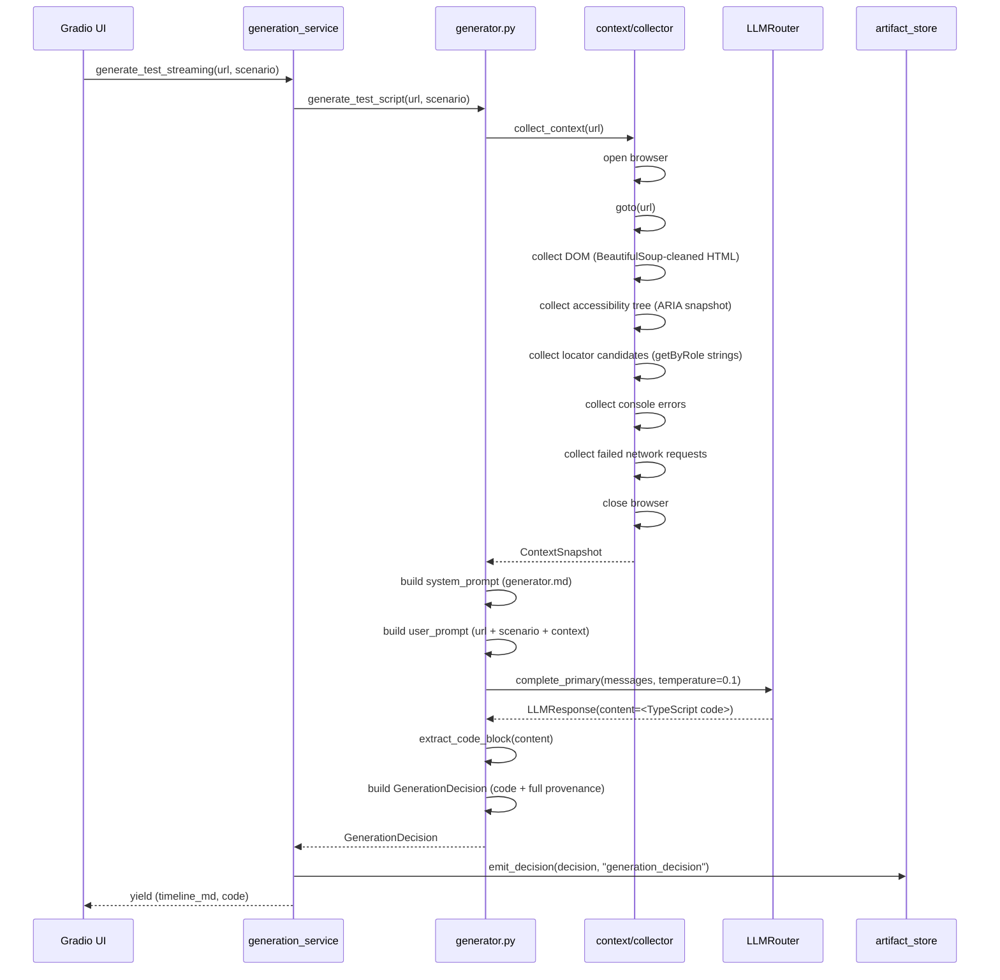
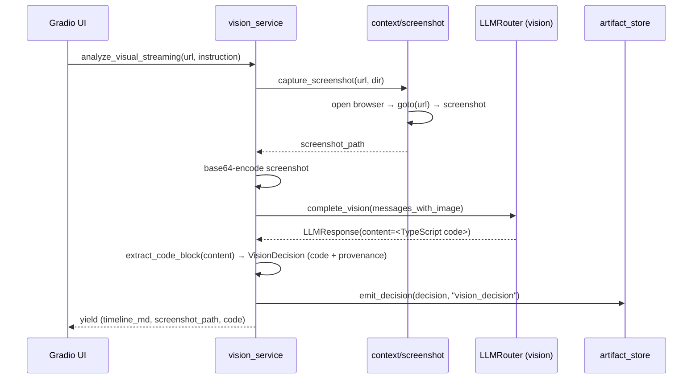

# Generation Pipeline Architecture

> Covers: `src/agents/generator.py`, `src/services/generation_service.py`, `src/services/vision_service.py`, `src/context/`

---

## Purpose

Two generation pipelines produce Playwright TypeScript specs from different input signals:

- **DOM generation**: URL + text scenario → spec using the page's structure and accessibility tree
- **Visual generation**: URL + instruction → screenshot → spec using what is visually present on screen

Both pipelines follow the same shape: collect context → assemble prompt → call LLM → validate response → write file.

---

## DOM Generation Pipeline

### Inputs

- Target URL (string)
- Test scenario (plain-English description)

### Outputs

- TypeScript `.spec.ts` file written to `tests/generated/`
- Streaming progress events yielded to the UI

### Sequence

### Context Collection

The generator sends five types of context to the LLM:

| Context type       | Source                           | Purpose                                                |
| ------------------ | -------------------------------- | ------------------------------------------------------ |
| Cleaned HTML       | `context/dom.py` (BeautifulSoup) | Structural elements, IDs, data-test attributes         |
| Accessibility tree | `context/accessibility.py`       | ARIA roles and names for `getByRole()` locators        |
| Locator candidates | `context/locator_candidates.py`  | Pre-extracted `getByRole()` strings from the a11y tree |
| Console errors     | `context/console.py`             | JavaScript errors during page load                     |
| Network errors     | `context/network.py`             | Failed requests (4xx, 5xx, CORS) during page load      |

All five are collected in a single Playwright browser session. One session = one cold start = one URL load. The `ContextSnapshot` Pydantic model carries all five.

### Generator Prompt Contract

`prompts/generator.md` instructs the LLM to:

1. Use `import { test, expect } from "@playwright/test"`
2. Prefer `data-test`, `id`, or specific `class` selectors
3. Output **only** the code block (no markdown fences, no prose)

The LLM response is extracted as a code block and validated into a `GenerationResult`.

---

## Visual Generation Pipeline

### Inputs

- Target URL (string)
- Instruction (plain-English description of the action to test)

### Outputs

- Screenshot file (written to `tests/screenshots/`)
- TypeScript `.spec.ts` file written to `tests/generated/`
- Streaming progress events

### Sequence

### Vision Prompt Contract

`prompts/vision.md` instructs the vision LLM to:

1. Always begin the test by navigating to the TARGET URL
2. Use `import { test, expect } from "@playwright/test"`
3. Prefer `getByPlaceholder()` for input fields where text is visible inside
4. Prefer `getByRole('button', { name: '...' })` for buttons
5. Prefer `getByLabel()` for fields with a label next to them
6. Use `getByText()` for general assertions

The screenshot is sent as a base64-encoded image in the user message. The LLM receives the visual layout, not the DOM.

---

## Running Generated Tests

`run_test_streaming(url, code, scenario)` in `generation_service.py`:

1. Writes the current code in the editor to `tests/generated/<slug>.spec.ts`
2. Runs `npx playwright test <file>` as a subprocess (via `healing/runner.run_test()`)
3. Streams stdout/stderr back to the UI

The same `runner.run_test()` function used by the healing pipeline is reused here. Test execution is instrumented by the observability layer.

---

## Tradeoffs

**Context window pressure.** The full page DOM can be very large. The generator truncates HTML at 30,000 characters and the accessibility tree at 5,000 characters before sending to the LLM. Locator candidates are capped at 20 items. These limits are tunable but represent a practical balance between context quality and token cost.

**Temperature 0.1.** Generation uses a slightly non-zero temperature to allow creative selector choices. Lowering to 0.0 would make generation fully reproducible but can produce slightly less natural selector patterns.

**No execution feedback loop.** The generator produces a spec without running it. The user clicks "Run Test" separately. A future iteration could run the spec automatically and retry if it fails — essentially applying the healing pipeline immediately after generation.

**Screenshot is captured fresh.** The vision pipeline takes a new screenshot at the moment of the request. It does not use any cached or historical state.
