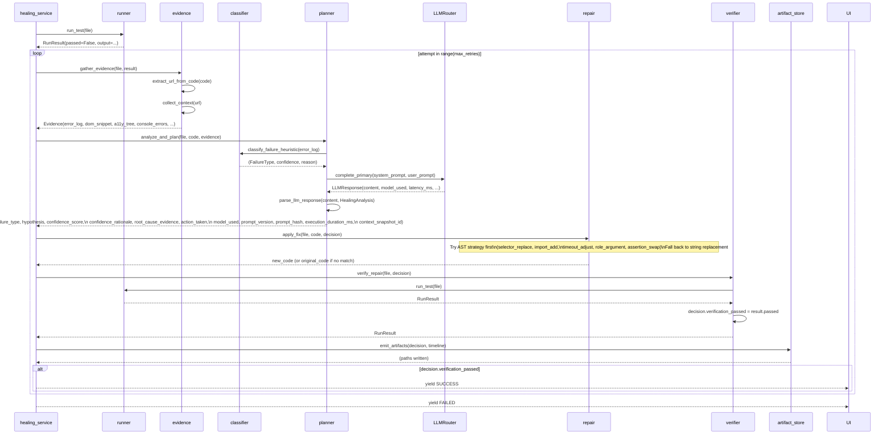

# Healing Pipeline Architecture

> Covers: `src/healing/`, `src/services/healing_service.py`, `schemas/healing.py`

---

## Purpose

The healing pipeline takes a broken Playwright spec and produces a repaired, verified spec plus a `HealingDecision` artifact that fully explains what failed, why, what was changed, and whether the change worked.

The pipeline has seven single-responsibility modules. Each is independently importable and testable without running the others.

---

## Inputs and Outputs

**Inputs:**

- A `.spec.ts` file path
- `max_retries` (integer, 1–5)

**Outputs:**

- Repaired `.spec.ts` file (written in place)
- `tests/artifacts/healing_decision_<timestamp>.json` — full `HealingDecision` artifact
- `tests/artifacts/execution_timeline_<timestamp>.json` — step-by-step audit trail
- JSONL spans in `logs/traces.jsonl` (session, LLM, subprocess)
- Streaming progress tuples yielded to the UI

---

## Module Responsibilities

| Module | File | Responsibility |
| --- | --- | --- |
| Runner | `src/healing/runner.py` | Run Playwright subprocess, capture exit code and output |
| Evidence | `src/healing/evidence.py` | Extract URL from test code, collect ContextSnapshot, build Evidence |
| Classifier | `src/healing/classifier.py` | Heuristic regex-based failure classification (no LLM) |
| Planner | `src/healing/planner.py` | LLM reasoning → HealingDecision with full provenance |
| Repair | `src/healing/repair.py` | AST-first code repair with string fallback |
| Verifier | `src/healing/verifier.py` | Re-run test after repair, update decision.verification_passed |
| Artifact store | `src/healing/artifact_store.py` | Persist HealingDecision + ExecutionTimeline as JSON |

---

## Sequence Diagram



---

## Failure Classification

`classify_failure_heuristic(error_log: str) -> tuple[FailureType, float, str]`

The classifier runs **before** the LLM call. It uses regex patterns to fast-path common failures:

| Failure type | Detection pattern | Confidence |
| --- | --- | --- |
| `LOCATOR_NOT_FOUND` | `"locator.*could not be found"` or `"resolved to 0 elements"` | 0.70 |
| `TIMEOUT` | `"TimeoutError"` or `"Timeout \d+ms exceeded"` | 1.00 |
| `JAVASCRIPT_ERROR` | `"ReferenceError"` or `"TypeError"` | 0.80 |
| `ASSERTION_FAILED` | `"expect(received).*expected"` | 0.80 |
| `UNKNOWN` | No pattern matched | 0.00 |

If the classifier returns confidence > 0.8 and the LLM returns `UNKNOWN`, the planner overrides the LLM with the heuristic result. This is the hybrid diagnosis strategy: deterministic where possible, LLM where needed.

---

## LLM Planning and Provenance

`analyze_and_plan()` in `src/healing/planner.py`:

1. Reads `prompt_version` from `prompts/manifest.json` via `get_prompt_version("healer")`
2. Computes `prompt_hash` (SHA-256 first 16 chars) via `get_prompt_hash("healer")`
3. Computes `context_snapshot_id` (SHA-256 first 12 chars of `evidence.error_log`)
4. Starts a `time.monotonic()` clock
5. Builds system prompt (healer.md with heuristic pre-diagnosis injected)
6. Builds user prompt (broken code + error log + DOM + a11y tree + locators + console + network)
7. Calls `LLMRouter.complete_primary()` → validates response as `HealingAnalysis`
8. Overrides `failure_type` from heuristic if high-confidence heuristic vs LLM UNKNOWN
9. Records `execution_duration_ms`
10. Returns `HealingDecision.from_analysis()` with all provenance fields populated

On any exception: returns a zero-confidence fallback `HealingDecision` with the error message. The healing loop always gets a valid object.

---

## AST Repair

`apply_fix()` in `src/healing/repair.py` tries two paths in order:

### Path 1: AST repair (when `repair_strategy != string_replace`)

Calls `scripts/ast_repair.js` as a Node.js subprocess with a JSON protocol:

```json
// stdin
{"strategy": "selector_replace", "source": "<full file content>", "original_code": "old", "fixed_code": "new"}

// stdout
{"success": true, "source": "<modified file content>", "changes": 2}
```

Strategies:

| Strategy | What the AST script does |
| --- | --- |
| `selector_replace` | Finds all matching locator/getByX calls and replaces the selector argument file-wide |
| `import_add` | Inserts a missing import declaration; merges named imports if module already present |
| `timeout_adjust` | Finds `{ timeout: N }` properties and updates the value |
| `role_argument` | Updates the `name` option in `getByRole()` calls |
| `assertion_swap` | Renames an assertion method in an `expect()` chain |

If AST produces 0 changes, logs a warning and falls through to Path 2.

### Path 2: String replacement

Sliding-window indentation-normalized match. Strips leading whitespace from both the target block and the file lines, finds the matching window, and replaces with the correct indentation restored.

If string replacement also fails, returns the original code unchanged and logs a warning. The healing loop detects `new_code == original_code` and marks the attempt as failed.

---

## HealingDecision Artifact

The `HealingDecision` Pydantic model is the authoritative record of a healing session:

```python
class HealingDecision(BaseModel):
    # Core diagnosis
    test_file: str
    failure_type: FailureType
    failure_summary: str
    evidence: Evidence
    hypothesis: str
    confidence_score: float          # 0.0–1.0
    reasoning_steps: List[str]
    action_taken: HealingAction      # original_code, fixed_code, description, repair_strategy
    verification_passed: bool
    verification_log: Optional[str]
    timestamp: str

    # Phase 9: Explainability provenance (all default to empty/0 for backward compat)
    model_used: str                  # e.g. "qwen3-coder-30b"
    prompt_version: str              # from prompts/manifest.json, e.g. "2"
    prompt_hash: str                 # SHA-256 first 16 chars of healer.md
    confidence_rationale: str        # LLM's explanation of confidence level
    root_cause_evidence: List[str]   # Specific log lines / DOM elements
    execution_duration_ms: int       # Wall-clock time for analyze_and_plan()
    context_snapshot_id: str         # SHA-256 first 12 chars of error_log
```

`to_markdown()` renders a human-readable report with sections: Diagnosis, Evidence, Root Cause Evidence, Resolution (with confidence rationale), Code Change, and Provenance.

---

## Tradeoffs

**Single file workspace copy.** The healer copies the uploaded file to `tests/generated/`. This is a simple design but means concurrent healing sessions for different files could conflict. Acceptable for a single-engineer tool; would need per-session temp directories in a multi-user deployment.

**Live DOM collection.** Evidence is collected by opening the page URL at healing time, not at failure time. For highly dynamic pages, the DOM may differ from the state at test failure. The accessibility tree and locator candidates are still useful for structural diagnosis.

**AST subprocess overhead.** The ts-morph subprocess adds ~50–100ms per repair call. This is negligible for a pipeline that takes seconds to minutes. The benefit is TypeScript-native AST access without Python having to understand TypeScript grammar.

**Bounded retry.** The healing loop is bounded by `max_retries` (default 3). This is intentional — unbounded retry loops risk infinite cost. The retry limit is user-configurable.
