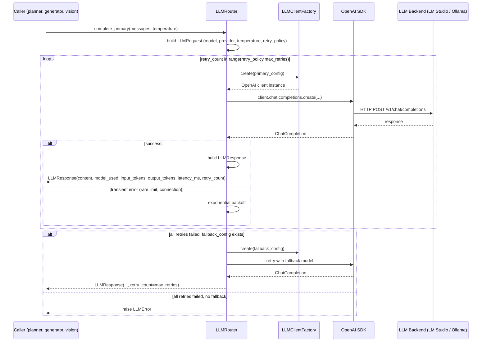

# LLM Layer Architecture

> Covers: `src/llm/` — `router.py`, `client.py`, `registry.py`, `policies.py`

---

## Purpose

The LLM layer provides a single, testable entry point for all LLM calls. It isolates provider configuration, retry logic, fallback behaviour, and response capture from the pipeline modules that use it.

**Design principle:** No module-level side effects. Importing `src/llm` causes no network calls, file I/O, or environment variable reads. Everything is deferred to the first call to `get_default_router()`.

---

## Components

```text
src/llm/
├── __init__.py        get_default_router() — lazy singleton
├── client.py          ProviderConfig (Pydantic) + LLMClientFactory
├── registry.py        ModelCapabilities + ModelRegistry
├── policies.py        RetryPolicy + TimeoutPolicy
└── router.py          LLMRequest + LLMResponse + LLMRouter
```

---

## Data Flow



---

## LLMRouter

`LLMRouter` is the main entry point. Two public methods:

```python
router.complete_primary(
    messages: list[dict],
    temperature: float = 0.1,
    max_tokens: int = 4096,
) -> LLMResponse

router.complete_vision(
    messages: list[dict],  # includes base64 image in user message
    temperature: float = 0.1,
) -> LLMResponse
```

`complete_primary()` uses the text/code model. `complete_vision()` uses the vision model (configured separately via `LM_STUDIO_VISION_MODEL` / `OLLAMA_VISION_MODEL`).

### LLMResponse

Every successful call returns:

```python
@dataclass
class LLMResponse:
    content: str             # raw model output
    model_used: str          # actual model name returned by the API
    provider: str            # "lm_studio" or "ollama"
    input_tokens: int        # tokens sent
    output_tokens: int       # tokens received
    latency_ms: int          # wall-clock time for the API call
    retry_count: int         # number of retries before success
    failure_reason: Optional[str]  # None on success
```

All fields are consumed by the observability layer (`record_llm_response()`) and by the planner for `HealingDecision.model_used`.

---

## Provider Configuration

Providers are configured via environment variables. `LLMClientFactory.create(config)` reads them at call time (not import time):

```env
LLM_PROVIDER=lm_studio          # or "ollama"
LM_STUDIO_URL=http://localhost:1234/v1
LM_STUDIO_MODEL=qwen3-coder-30b
LM_STUDIO_VISION_MODEL=qwen2.5-vl-7b
LM_STUDIO_API_KEY=lm-studio     # any non-empty string

OLLAMA_URL=http://localhost:11434/v1
OLLAMA_MODEL=qwen3-coder:30b
OLLAMA_VISION_MODEL=llava:13b
OLLAMA_API_KEY=ollama
```

Both providers speak the OpenAI REST API (`/v1/chat/completions`). The same `openai.OpenAI(base_url=..., api_key=...)` client handles both. This is why LiteLLM was not needed — see ADR-007.

---

## Model Registry

`ModelRegistry` maps model names to capability metadata:

```python
@dataclass
class ModelCapabilities:
    supports_vision: bool
    supports_structured_output: bool
    context_window: int
    cost_per_1k_input: float
    cost_per_1k_output: float
```

The registry is used to select the appropriate model for vision vs. text calls and to gate structured output mode. It does not make network calls — it is a static lookup table configured at startup.

---

## Retry Policy

```python
class RetryPolicy(BaseModel):
    max_retries: int = 3
    base_delay_seconds: float = 1.0
    backoff_multiplier: float = 2.0
    retryable_status_codes: list[int] = [429, 500, 502, 503, 504]
```

Retries fire on: transient HTTP errors (5xx, 429), connection errors, and empty responses. Non-retryable errors (400 Bad Request, 401 Unauthorized) raise immediately.

---

## Testability

All unit tests in the suite use mocked routers. The `LLMRouter` is injected into pipeline modules via `get_default_router()`, which returns a cached singleton. Tests patch `src.healing.planner.get_default_router` to return a `MagicMock` with a controlled `complete_primary.return_value`. Zero live LLM calls across 440 tests.

---

## Why Not LiteLLM?

LiteLLM's value is provider abstraction — normalising APIs from OpenAI, Anthropic, Cohere, Bedrock, etc. This project uses only OpenAI-compatible local endpoints. Adding LiteLLM would:

- Add ~40 MB to the dependency tree
- Introduce global state that complicates test mocking
- Add abstraction over something that `openai.OpenAI(base_url=...)` already handles

If a non-OpenAI-compatible provider is ever needed, the `LLMClientFactory` can be extended to return a different client backend without changing the `LLMRouter` API. LiteLLM is the right choice at that point. See ADR-007.
