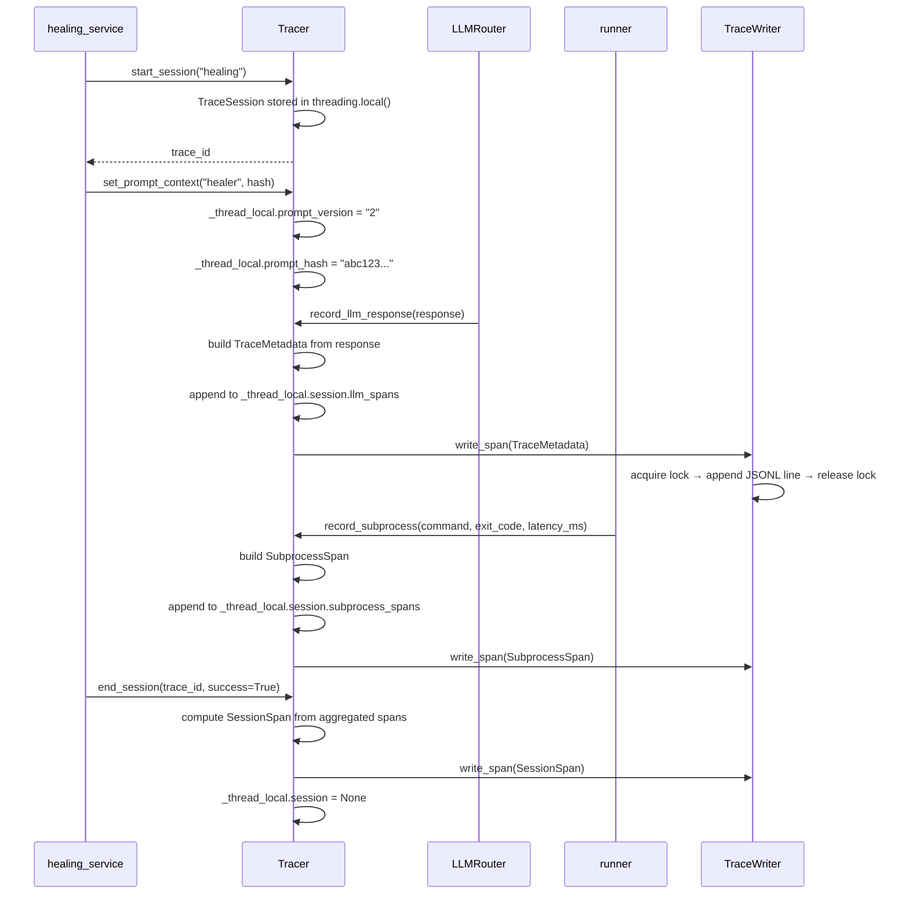

# Observability Architecture

> Covers: `src/observability/` — `tracer.py`, `writer.py`, `schemas.py`, `__init__.py`

---

## Purpose

The observability layer records every LLM call, every Playwright subprocess call, and every end-to-end session as structured JSON spans in `logs/traces.jsonl`. Spans from the same session share a `trace_id` for correlation.

**Design constraint:** Observability must never break the main path. Every instrumentation point is wrapped in try/except. A bug in the tracer cannot affect healing.

---

## Components

```text
src/observability/
├── __init__.py    get_tracer() / configure_tracer() — module-level API
├── tracer.py      Tracer (thread-local sessions) + NullTracer (no-op default)
├── writer.py      TraceWriter — thread-safe JSONL appender
└── schemas.py     SubprocessSpan, SessionSpan, TraceSession
```

`schemas/artifacts.py` defines `TraceMetadata` (the LLM call span). It lives in `schemas/` so it can be referenced by the artifact layer without a circular import.

---

## Span Types

### TraceMetadata (LLM call span)

Written by `LLMRouter._build_response()` after every successful LLM call:

```json
{
  "span_type": "llm",
  "trace_id": "a1b2c3d4-e5f6-...",
  "operation_id": "uuid4",
  "model": "qwen3-coder-30b",
  "model_version": "",
  "prompt_version": "2",
  "prompt_hash": "abc123def456abcd",
  "input_tokens": 4821,
  "output_tokens": 312,
  "latency_ms": 3400,
  "retry_count": 0,
  "failure_reason": null,
  "timestamp": "2026-06-06T14:23:11.456789"
}
```

### SubprocessSpan (Playwright call span)

Written by `healing/runner.run_test()` after every subprocess:

```json
{
  "span_type": "subprocess",
  "trace_id": "a1b2c3d4-e5f6-...",
  "operation_id": "uuid4",
  "command": "npx playwright test tests/generated/broken.spec.ts",
  "exit_code": 0,
  "latency_ms": 7100,
  "success": true,
  "timestamp": "2026-06-06T14:23:15.123456"
}
```

### SessionSpan (end-to-end span)

Written by `end_session()` when a healing or generation session completes:

```json
{
  "span_type": "session",
  "trace_id": "a1b2c3d4-e5f6-...",
  "session_type": "healing",
  "total_latency_ms": 12600,
  "llm_call_count": 1,
  "subprocess_call_count": 2,
  "total_input_tokens": 4821,
  "total_output_tokens": 312,
  "total_retry_count": 0,
  "success": true,
  "timestamp": "2026-06-06T14:23:18.789012"
}
```

---

## Thread-Local Session Isolation

Gradio runs each event handler on its own thread. If two users trigger healing simultaneously, their sessions must not share state.

The tracer stores the active `TraceSession` in `threading.local()`:

```python
_thread_local = threading.local()

def start_session(self, session_type: str) -> str:
    session = TraceSession(trace_id=str(uuid4()), ...)
    _thread_local.session = session
    return session.trace_id

def record_llm_response(self, response) -> Optional[TraceMetadata]:
    session = getattr(_thread_local, "session", None)
    if session is None:
        return None  # no active session on this thread — no-op
    ...
```

Each thread has its own `_thread_local.session`. A session started on Thread A is invisible to Thread B. `end_session()` clears `_thread_local.session` after writing the `SessionSpan`.

---

## NullTracer

The global tracer is a `NullTracer` until `configure_tracer()` is called:

```python
# src/observability/__init__.py
_tracer: Union[Tracer, NullTracer] = NullTracer()

def get_tracer() -> Union[Tracer, NullTracer]:
    return _tracer
```

`NullTracer` implements the same interface as `Tracer` — every method is a no-op that returns `None` or `""`. This means:

- Pipeline modules can call `get_tracer().record_llm_response(...)` unconditionally
- No guard code like `if tracer is not None:` appears anywhere in the codebase
- If the app is launched without `configure_tracer()`, nothing fails

---

## Sequence Diagram



---

## JSONL Format and Querying

All spans are appended as newline-delimited JSON to `logs/traces.jsonl`. The file grows indefinitely — no rotation is implemented. Rotate manually or with `logrotate` if the file grows large.

Useful `jq` queries:

```bash
# Total tokens and cost proxy per session
jq 'select(.span_type=="session") | {
  trace_id, success, total_input_tokens, total_output_tokens, total_latency_ms
}' logs/traces.jsonl

# LLM calls with retries (indicates transient provider errors)
jq 'select(.span_type=="llm" and .retry_count > 0)' logs/traces.jsonl

# Failed healing sessions
jq 'select(.span_type=="session" and .success==false)' logs/traces.jsonl

# Slowest Playwright runs
jq 'select(.span_type=="subprocess") | {command, latency_ms, exit_code}' \
  logs/traces.jsonl | sort -t: -k2 -n

# Sessions grouped by success rate
jq -s 'map(select(.span_type=="session")) |
  {total: length, passed: (map(select(.success)) | length)}' logs/traces.jsonl
```

---

## Why Custom JSONL Instead of OpenTelemetry?

The `LLMRouter` already captures all required signals (`input_tokens`, `output_tokens`, `latency_ms`, `retry_count`, `model_used`). The tracer only needs to persist and link these — not instrument HTTP calls or parse SDK internals.

Adding `opentelemetry-sdk` would:

- Add ~5 MB to the dependency tree (violates "prefer deletion over addition")
- Require an exporter configuration and collector setup for local use
- Produce spans in OTEL format, which requires `jq` knowledge of OTEL conventions

The JSONL format is human-readable, `jq`-queryable, and sufficient for a single-engineer project. The span schemas are designed to be compatible with OTEL semantic conventions — swapping `TraceWriter` for a `LangfuseExporter` would not require changing the `Tracer` API.

See ADR-004 for the full evaluation.

---

## Upgrade Path

To migrate to OpenTelemetry:

1. Implement `OtelTraceWriter(TraceWriter)` that exports to an OTEL collector instead of a file
2. Call `configure_tracer(writer=OtelTraceWriter(...))` at startup
3. No changes to `Tracer`, `NullTracer`, or any instrumentation points

To migrate to Langfuse:

1. Implement `LangfuseTraceWriter` that calls the Langfuse client
2. Same substitution as above

The tracer interface is stable. The writer is the only swappable component.
