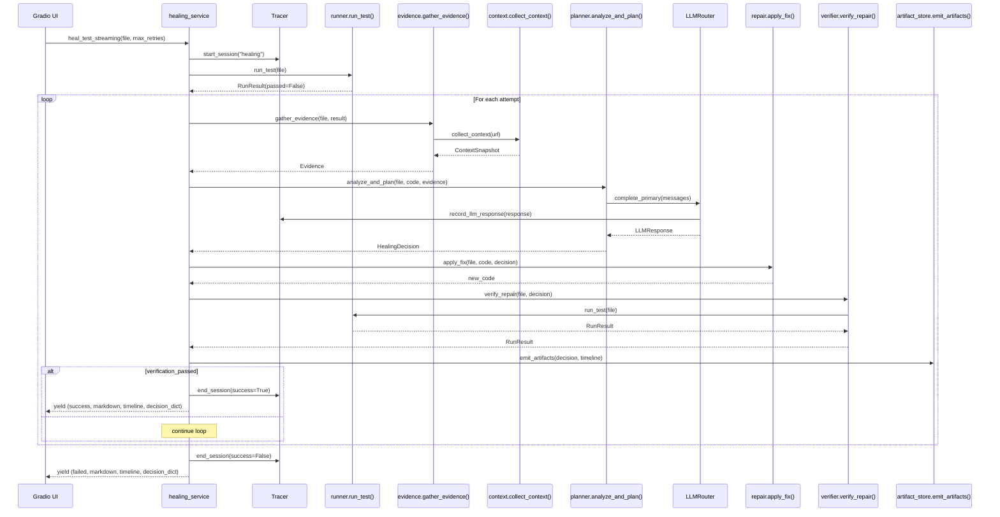

# Architecture Overview

> This document describes the implemented architecture as of Phase 10 (UI Reposition).
> All components described here exist in the codebase.

---

## Purpose

The AI Engineering Workbench is a pipeline system. Raw inputs (URLs, test scenarios, broken specs) flow through a sequence of pipeline stages — each with a single responsibility — and produce structured outputs (TypeScript specs, HealingDecision artifacts, JSONL traces).

The architecture is designed around three constraints:

1. **The UI must never own business logic.** `src/app.py` is pure Gradio wiring.
2. **Every LLM response must be validated before use.** No raw JSON is trusted.
3. **Observability and repair must never break the main path.** Both are wrapped in try/except.

---

## Layer Map

```text
┌─────────────────────────────────────────────────────────────────────┐
│                          Gradio UI (src/app.py)                      │
│  6 tabs — Generation | Healing | Vision | Artifacts | Bench | Traces │
└──────────────────────────┬──────────────────────────────────────────┘
                           │ imports only from src/services/
┌──────────────────────────▼──────────────────────────────────────────┐
│                        Service Layer (src/services/)                  │
│  generation_service  healing_service  vision_service  workbench_service│
└──────┬──────────────────┬──────────────────┬────────────────────────┘
       │                  │                  │
┌──────▼──────┐  ┌────────▼──────┐  ┌───────▼──────────────────────┐
│ src/agents/ │  │ src/healing/  │  │ src/context/                 │
│ generator   │  │ runner        │  │ collector → dom              │
│ vision      │  │ classifier    │  │          → accessibility     │
│ healer shim │  │ planner       │  │          → console           │
└──────┬──────┘  │ repair        │  │          → network           │
       │         │ verifier      │  │          → locator_candidates│
       │         │ evidence      │  │          → screenshot        │
       │         │ artifact_store│  └──────────────────────────────┘
       │         └────────┬──────┘
       │                  │
┌──────▼──────────────────▼──────────────────────────────────────────┐
│                     LLM Layer (src/llm/)                             │
│  LLMRouter → retry → fallback → LLMClientFactory → OpenAI SDK       │
│  LLMRequest / LLMResponse (Pydantic)                                 │
└──────────────────────────┬─────────────────────────────────────────┘
                           │ instrument every call
┌──────────────────────────▼─────────────────────────────────────────┐
│               Observability Layer (src/observability/)               │
│  Tracer (thread-local) → TraceWriter → logs/traces.jsonl             │
└────────────────────────────────────────────────────────────────────┘

Schemas (schemas/)  ←── data contracts between all layers (Pydantic)
Benchmarks (benchmarks/)  ←── evaluation runners (read-only, no I/O side effects)
```

---

## Data Contracts

All inter-layer communication uses Pydantic models from `schemas/`. No raw dicts cross layer boundaries in production code paths.

| Schema | Where defined | Produced by | Consumed by |
| --- | --- | --- | --- |
| `HealingAnalysis` | `schemas/healing.py` | LLM via `parse_llm_response()` | `planner.py` |
| `HealingDecision` | `schemas/healing.py` | `planner.py` | `healing_service.py`, `artifact_store.py`, UI |
| `Evidence` | `schemas/healing.py` | `evidence.py` | `planner.py` |
| `HealingAction` | `schemas/healing.py` | LLM (nested in HealingAnalysis) | `repair.py` |
| `ContextSnapshot` | `schemas/artifacts.py` | `context/collector.py` | `evidence.py`, `generator.py` |
| `TraceMetadata` | `schemas/artifacts.py` | `llm/router.py` | `observability/tracer.py` |
| `LLMRequest` / `LLMResponse` | `src/llm/router.py` | `LLMRouter.complete_*()` | all callers |
| `GenerationResult` | `schemas/generation.py` | `generator.py` | `generation_service.py` |
| `BenchmarkRun` | `schemas/evaluation.py` | benchmark runners | `workbench_service.py`, reports |
| `RunResult` | `schemas/shared.py` | `healing/runner.py` | `healing_service.py` |

---

## Key Design Decisions

**No module-level LLM initialization.** `get_default_router()` is a lazy singleton. Importing `src/llm` causes no network calls or file I/O. Every unit test in the suite runs without LLM credentials.

**NullTracer default.** The global tracer is a `NullTracer` until `configure_tracer()` is called. All instrumentation points are safe to call at any time — no guard code needed at call sites.

**Thread-local session isolation.** Gradio runs each event handler on its own thread. Tracer sessions are stored in `threading.local()` so concurrent healing sessions never cross-contaminate.

**Services use generator functions.** All `*_streaming()` service functions are Python generators that `yield` progress tuples. Gradio's streaming model maps directly to this — no async required.

**Fallback on every failure path.** `analyze_and_plan()` returns a zero-confidence `HealingDecision` instead of raising. `apply_fix()` falls back from AST to string replacement, then returns the original code unchanged. `record_llm_response()` is wrapped in try/except. Nothing in the healing pipeline can crash the service layer.

---

## Component Summaries

| Component | File(s) | Responsibility |
| --- | --- | --- |
| Generation pipeline | `src/agents/generator.py` | Context collection → prompt → LLM → GenerationResult |
| Vision pipeline | `src/agents/vision.py` | Screenshot → vision LLM → TypeScript |
| Healing pipeline | `src/healing/` (7 modules) | Failure diagnosis, repair, verification, artifact emission |
| Context collection | `src/context/` (7 modules) | Single browser session → ContextSnapshot |
| LLM routing | `src/llm/` (4 modules) | Provider config, retry, fallback, response capture |
| Observability | `src/observability/` (3 modules) | Thread-local session tracking → JSONL spans |
| Evaluation | `benchmarks/` (3 runners + mutator) | Dataset-driven reproducible benchmarks |
| Data contracts | `schemas/` (5 modules) | Pydantic models for all structured data |
| Prompt management | `prompts/` + `prompt_loader.py` | External markdown + manifest.json versioning |

---

## Sequence: End-to-End Healing Session



---

## See Also

- [`healing.md`](healing.md) — healing pipeline deep dive
- [`generation.md`](generation.md) — generation pipeline
- [`llm-layer.md`](llm-layer.md) — LLM routing, retry, fallback
- [`observability.md`](observability.md) — JSONL tracer architecture
- [`context-collection.md`](context-collection.md) — browser context collection
- [`evaluation.md`](evaluation.md) — benchmark framework
